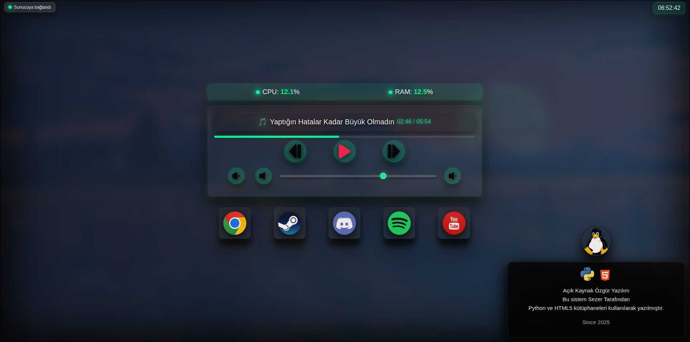

# Spanel

Flask + Flask-SocketIO tabanlı sistem ve medya kontrol paneli. V.2.0



## Kurulum

1. Repo’yu klonla:
```bash
git clone https://github.com/mynameissk/Spanel.git
cd Spanel
```
2. Paneli başlatma:
```bash
source venv/bin/activate
python server.py --port 5001
```
3.Not: Localhost 5001 portunda çalışır, istenilirse internete açılabilir. Port değişimi "server.py" üzerinden yapılabilir.
```bash
127.0.0.1:5001
Makine IP adres:5001
```
- "requirements.txt" içerisinde bulunan bağımlılıkları yüklemeniz gerekmektedir.
- "start_panel.sh" çalışır durumda fakat servis olarak root haklarıyla çalıştığı için Steam, Discord vb. GUI tabanlı programların açılışında problem yaratır yada hiç açılmaz. Bunu bir servise entegre edip
```bash
systemctl --user enable panel.service
```
Olarak --user parametresiyle çalıştırmak yine bu sorunu çözmeyecektir.


Sürüm Notları:
V1.0: -Ana sürüm

V1.1: -İletişim hataları giderildi: SocketIO iyileştirmeleri, Backend&Frontend App entegresi: Youtube,Spotify uygulamaları eklendi.

V2.0: UI Güncellemeleri ve Backend&Frontend İyileştirmeleri: Süre ve Progress bar eklendi, CSS düzenlemeleri yapıldı,
