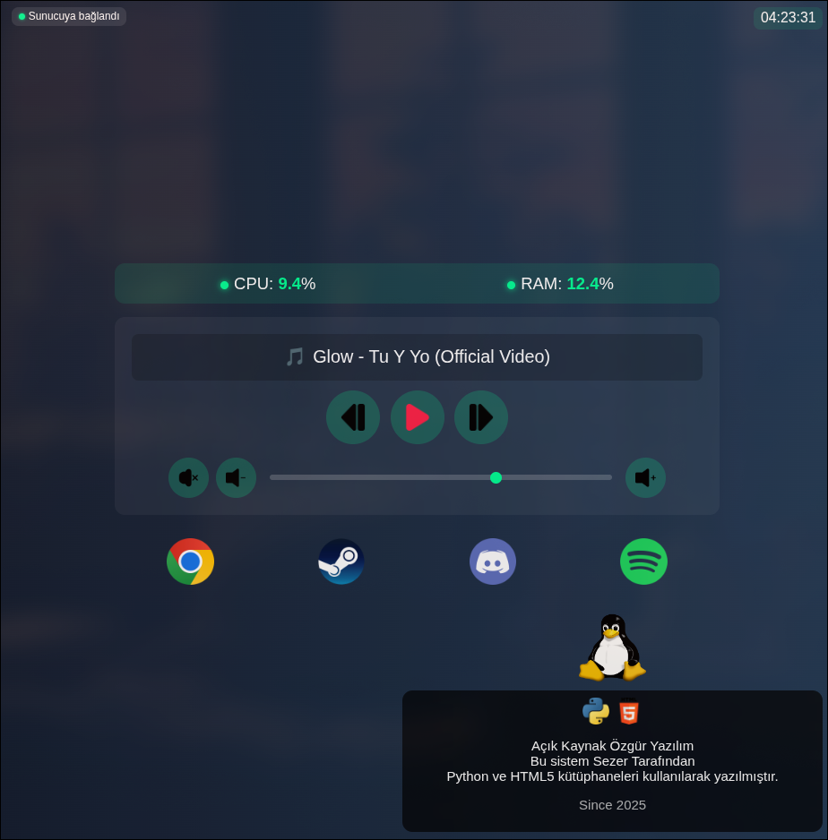

# Spanel

Flask + Flask-SocketIO tabanlı sistem ve medya kontrol paneli.



## Kurulum

1. Repo’yu klonla:
```bash
git clone https://github.com/mynameissk/Spanel.git
cd Spanel
```
2. Paneli başlatma:
```bash
source venv/bin/activate
python server.py --port 5001
```
3.Not: Localhost 5001 portunda çalışır, istenilirse internete açılabilir.
```bash
127.0.0.1:5001
Makine IP adres:5001
```
